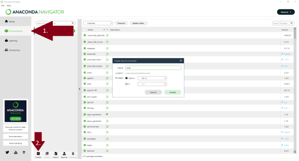

=========================
Windows operating systems
=========================

Microsoft C++ Build Tools
=========================

To use our library and AiiDA on Windows the programm Microsoft |visual_studio| is needed.
Make sure that the following boxes are ticked.

.. image:: Images/Microsoft_C++_Build_Tools_Installation_Guide.png
    :width: 800px
    :align: center
    :alt: Microsoft_C++_Build_Tools_Installation_Guide.png

Anaconda & Virtual Environment
==============================

If you are not familiar working in the cmd window or with the powershell, Anaconda is a helpful tool.
If you are comfortable with cmd or powershell, you can jump straight to the installation of AiiDA.
It is recommended to install all python packages in a virtual enviroment.

First, |anaconda| has to be installed.
After this is done, a new enviroment has to be created.
Then, you can click on **environments**, select **create**, use *aim2dat* as name, *Python 3.9* (or a more recent version) as the package and click **create**.

Next, the enviroment has to be started.
To do so, click on the green **play button** next to aiida and select **Open Terminal**.

.. image:: Images/Anaconda_Start_env.png
    :width: 800px
    :align: center
    :alt: Anaconda_Start_env.png

The library can be readily installed via pip:

.. code-block:: bash

    pip install aim2dat

.. |visual_studio| raw:: html

   <a href="https://visualstudio.microsoft.com/de/visual-cpp-build-tools" target="_blank">C++ Build Tools</a>

.. |anaconda| raw:: html

   <a href="https://docs.anaconda.com/anaconda/install/windows" target="_blank">anaconda</a>
